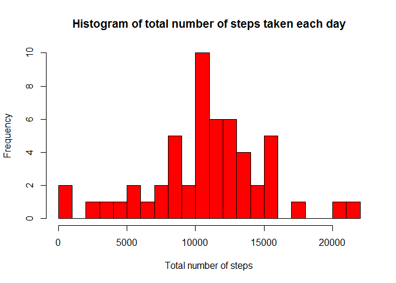
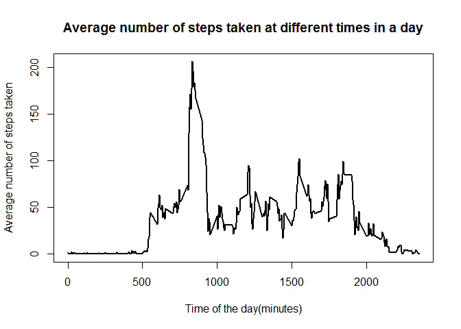
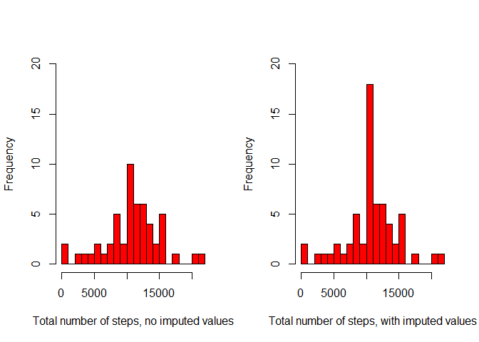
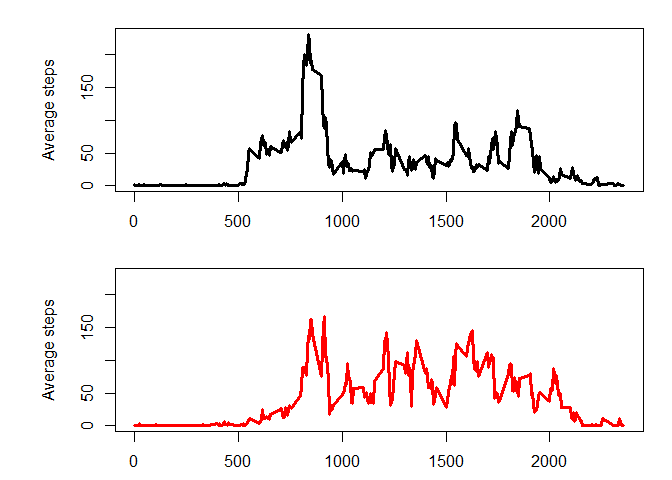

# Reproducible Research: Peer Assessment 1


## Loading and preprocessing the data

Code for downloading and unzipping the file.


```r
setwd("C:/Downloads")
url<-"https://d396qusza40orc.cloudfront.net/repdata%2Fdata%2Factivity.zip"
download.file(url, destfile = "activitydata.zip", method = "curl")
unzip("activitydata.zip")
```

Code for reading in the file. Any transformations required will be specified as and when required.


```r
activity <- read.csv("C:/Downloads/activity.csv", header = TRUE)
```

Assigning "Date" class to the dates


```r
activity$date<- as.Date(as.character(activity$date))
```


## What is mean total number of steps taken per day?

Code for summing up steps taken per day and converting it into a data frame fromat


```r
totalsteps <- tapply(activity$steps, activity$date, sum)
total <- data.frame(totalsteps)
```

###Histogram of total number of steps taken per day


```r
hist(total$totalsteps, breaks = 20, col = "red", xlim = c(0,22000),
     main = "Histogram of total number of steps taken each day",
     xlab = "Total number of steps")
```

 

###Mean and median total number of steps taken per day

summary table showing the mean and median toal number of steps taken per day


```r
summary(total)
```

```
##    totalsteps   
##  Min.   :   41  
##  1st Qu.: 8841  
##  Median :10765  
##  Mean   :10766  
##  3rd Qu.:13294  
##  Max.   :21194  
##  NA's   :8
```


## What is the average daily activity pattern?

Code for extracting the number of steps taken during a given interval averaged across all days. The data was converted into a data frame containing values of the time intervals and the average number of steps for that time interval.


```r
intavg <- tapply(activity$steps, activity$interval, mean, na.rm = TRUE)
int<- data.frame(intavg)
interval<- dimnames(int)[[1]]
interval<- as.numeric(interval)
byint<- data.frame(interval, int$intavg)
```

###Time series plot of the average number of steps taken in a given interval


```r
plot(byint$interval, byint$int.intavg, type = "l", lwd = 2,
     main = "Average number of steps taken at different times in a day",
     xlab = "Time of the day(minutes)", ylab = "Average number of steps taken")
```

 

###Maximum average number of steps

Code extracting the time interval with the maximum average number of steps in a day and its value


```r
byint[which.max(byint$int.intavg),]
```

```
##     interval int.intavg
## 835      835      206.2
```


## Imputing missing values

###Number of missing values

Code showing the total number of missing values in the dataset


```r
sum(is.na(activity))
```

```
## [1] 2304
```

###Imputing missing values

The strategy used here was to replace all missing values with the mean of the values for the particular time interval across all days that the missing value belonged to. To achieve this, first the dataset was converted to a data table and then the average steps across days for the various time intervals were appended to the table. Following this, an "ifelse" function was used to replace all NAs with the corresponding means.

Code for converting the data into a data table


```r
library(data.table)
actimpute<- data.table(activity)
```

Code for imputing missing values with the mean number of steps taken in the corresponding time interval and creating new dataset with it


```r
actimpute[,avgsteps:= mean(steps, na.rm = TRUE), by=interval]
actimpute$steps <- ifelse(is.na(actimpute$steps), 
                          actimpute$avgsteps, actimpute$steps)
```

Code to show imputing worked


```r
sum(is.na(actimpute))
```

```
## [1] 0
```

###Mean and median after imputing missing values

Code for summing up total steps taken per day and converting it into a data frame fromat for the data with imputed values


```r
totalstepsimp = tapply(actimpute$steps, actimpute$date, sum)
totalimp<- data.frame(totalstepsimp)
```

Summary statistics to show that the mean and median total steps per day have not changed after imputing missing values


```r
summary(totalimp)
```

```
##  totalstepsimp  
##  Min.   :   41  
##  1st Qu.: 9819  
##  Median :10766  
##  Mean   :10766  
##  3rd Qu.:12811  
##  Max.   :21194
```

###Histogram of total number of steps taken after imputing missing values

Histogram showing a comparison of the total steps taken in a day calculated before(left) and after(right) imputing data. Note that there is a selective increase only in the mean/median value and nowhere else.


```r
par(mfrow = c(1,2))

hist(total$totalsteps, breaks = 20, col = "red", xlim = c(0,22000), main = "",
     xlab = "Total number of steps, no imputed values", ylim = c(0,20))

hist(totalimp$totalstepsimp, breaks = 20, col = "red", xlim = c(0,22000),
     xlab = "Total number of steps, with imputed values", ylim = c(0,20),
     main = "")
```

 


## Are there differences in activity patterns between weekdays and weekends?

Code to subset data based on the day of the week


```r
actimpute$date<- as.Date(actimpute$date)
actimpute$day<- weekdays(actimpute$date, abbreviate =T)
actimpute$day<- as.factor(actimpute$day)
actimpweekend<- subset(actimpute, (day == "Sat"|day == "Sun"))
actimpweekday<- subset(actimpute, !(day == "Sat"|day == "Sun"))
```

Code to extract average daily patterns for each time interval for weekends


```r
weekend <- tapply(actimpweekend$steps, actimpweekend$interval, mean)
end<- data.frame(weekend)
intervalend<- dimnames(end)[[1]]
intervalend<- as.numeric(intervalend)
byintend<- data.frame(intervalend, end$weekend)
```

Code to extract average daily patterns for each time interval for weekdays


```r
weekday <- tapply(actimpweekday$steps, actimpweekday$interval, mean)
day<- data.frame(weekday)
intervalday<- dimnames(day)[[1]]
intervalday<- as.numeric(intervalday)
byintday<- data.frame(intervalday, day$weekday)
```

###Difference in acivity patterns between weekdays and weekends

Code to plot average daily acitvity patterns based on the day of the week


```r
par(fin = c(6,4), mai = c(0.5,1.2,0.3,0.3))
par(mfrow = c(2,1))
plot(byintday$intervalday, byintday$day.weekday, type = "l", lwd = 3,
     main = "", xlab = "Time of the day(minutes)",     
     ylab = "Average steps", ylim = c(0,230))

plot(byintend$intervalend, byintend$end.weekend, type = "l", lwd = 3,
     main = "", col = "red", ylim = c(0,230), xlab = "Time of the day(minutes)", ylab = "Average steps")
```

 

Panel plot showing the average daily activity pattern for weekdays(top, black) and weekends (bottom, red). Note that there is a sharp peak for daily activity patterns on weekdays and comparitively lesser activity during the rest of the day whereas on weekends, the peak is lower and activity patterns are far more distributed throughout the day.
